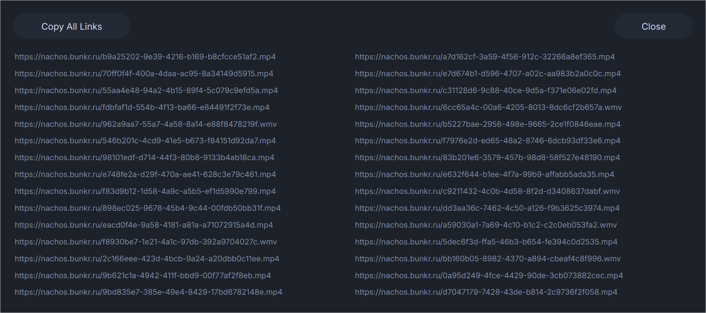

# Bunkr Video URL Extractor

## Installation

1. Install the Tampermonkey extension on either [Chrome](https://chrome.google.com/webstore/detail/tampermonkey/dhdgffkkebhmkfjojejmpbldmpobfkfo) or [Firefox](https://addons.mozilla.org/en-US/firefox/addon/tampermonkey/)
2. Make sure to allow the extension to run in incognito mode if relevant. Instructions on how to do so can be found on the support pages for [Chrome](https://support.google.com/chrome/a/answer/13130396?hl=en) and [Firefox](https://support.mozilla.org/en-US/kb/extensions-private-browsing)
3. Once installed, [click this link](https://github.com/Xenon2434/BunkrDownload/raw/refs/heads/main/Bunkr.user.js) to add the script to Tampermonkey (make sure to press the install button in the new tab that opens)
4. Open a Bunkr Album and try it out (see instructions below) 

## Usage Instructions

1. The script activates on Bunkr.cr album pages (https://bunkr.cr/a/ZpE18HMP, for example)
2. A "Generate Links" button is added to the top right of the page: 

3. Upon clicking the button, the script will analyze and extract a direct download URL for each video on the page.
4. Once the script has finished, a popup will appear containing all extracted URLs. You can use the "Copy All Links" button to quickly copy into Jdownloader or another downloading tool of your choice: 

